# 🌐 ZKAttendance Web


## 📖 Overview

Web-based attendance management system for viewing and managing employee attendance data. This frontend application retrieves and displays attendance records from the database, while the companion service **[ZKAttendanceService](https://github.com/Faisal-Sahli/ZKAttendanceService)** handles automatic data collection from ZKTeco biometric devices.

### 🎯 Key Features

- 📊 Display attendance records with advanced filtering
- 📈 Generate daily, weekly, and monthly reports
- 👥 Manage employee information (CRUD operations)
- 📱 Responsive design for all devices
- 🔒 Secure authentication system

---

## 🏗️ System Architecture

```mermaid
graph TD
    A[👤 Employee<br/>Fingerprint Punch]
    B[🔌 ZKTeco Device]
    C[⚙️ ZKAttendanceService<br/>Background Worker]
    D[(💾 SQL Server Database)]
    E[🌐 ZKAttendanceWeb<br/>ASP.NET Core MVC]
    F[👥 HR Managers & Admins]

    A -->|Biometric Scan| B
    B -->|TCP/IP| C
    C -->|Sync Data| D
    D -->|Read Data| E
    E -->|View & Manage| F

    style A fill:#e1f5ff,stroke:#0288d1
    style B fill:#fff3e0,stroke:#ff6f00
    style C fill:#f3e5f5,stroke:#7b1fa2
    style D fill:#e8f5e9,stroke:#388e3c
    style E fill:#fce4ec,stroke:#c2185b
    style F fill:#e0f2f1,stroke:#00796b
```



| Layer | Component | Technology | Purpose |
|-------|-----------|------------|---------|
| **Hardware** | ZKTeco Device | Fingerprint Scanner | Employee identification |
| **Service** | ZKAttendanceService | C# Background Worker | Data collection & sync |
| **Data** | SQL Server | Database Server | Centralized storage |
| **Presentation** | ZKAttendanceWeb | ASP.NET Core MVC | User interface |
| **User** | HR Managers | Web Browser | View & manage data |

> **Note:** This web application reads data only. Actual device communication is handled by [ZKAttendanceService](https://github.com/Faisal-Sahli/ZKAttendanceService).

---

## 🛠️ Technology Stack

**Backend:** ASP.NET Core 8.0 MVC • Entity Framework Core • C# 12 • LINQ

**Frontend:** HTML5 • CSS3 • JavaScript • Bootstrap 5 • jQuery • Razor Pages

**Database:** SQL Server 2019+ • EF Core Migrations

**Architecture:** MVC Pattern • Repository Pattern • Service Layer • Dependency Injection

**Security:** ASP.NET Core Identity • HTTPS • Input Validation

---

## 📁 Project Structure

```
ZKAttendanceWeb/
├── Controllers/           # MVC Controllers
├── Views/                 # Razor Views
├── Models/                # View Models and Entities
├── Services/              # Business Logic Layer
├── Data/                  # DbContext and Migrations
├── wwwroot/               # Static files (CSS, JS, Images)
├── appsettings.json       # Configuration
└── Program.cs             # Application entry point
```

---

## 🚀 Getting Started

### Prerequisites

- **.NET SDK 8.0+**
- **SQL Server 2019+**
- **Visual Studio 2022+** or VS Code
- **ZKAttendanceService** (must be installed and running)

### Installation

1. **Clone the repository**
```bash
git clone https://github.com/Faisal-Sahli/ZKAttendanceWeb.git
cd ZKAttendanceWeb
```

2. **Restore dependencies**
```bash
dotnet restore
```

3. **Update connection string in `appsettings.json`**
```json
{
  "ConnectionStrings": {
    "DefaultConnection": "Server=YOUR_SERVER;Database=ZKAttendance;User Id=YOUR_USER;Password=YOUR_PASSWORD;TrustServerCertificate=True;"
  }
}
```

4. **Apply database migrations**
```bash
dotnet ef database update
```

5. **Run the application**
```bash
dotnet run
```

6. **Access the application**
   - URL: `https://localhost:5001`
   - Default Login: `admin` / `Admin@123`

---

## 🔌 API Endpoints

### Employees
```
GET    /api/employees              # Get all employees
GET    /api/employees/{id}         # Get employee by ID
POST   /api/employees              # Create new employee
PUT    /api/employees/{id}         # Update employee
DELETE /api/employees/{id}         # Delete employee
```

### Attendance
```
GET    /api/attendance                  # Get all records
GET    /api/attendance/employee/{id}    # By employee
GET    /api/attendance/date/{date}      # By date
GET    /api/attendance/range            # By date range
```

### Reports
```
GET    /api/reports/daily           # Daily report
GET    /api/reports/monthly         # Monthly summary
GET    /api/reports/employee/{id}   # Employee history
POST   /api/reports/export          # Export to Excel
```

---

## 📊 Database Schema

Shared database with **ZKAttendanceService**:


---

## 🎯 Roadmap

### ✅ Phase 1 - Core (Current)
- [x] MVC structure & Employee management
- [x] Attendance viewing & Authentication
- [ ] Dashboard with charts
- [ ] Advanced filtering

### 🔄 Phase 2 - Enhanced
- [ ] Leave management
- [ ] Shift scheduling
- [ ] Excel/PDF reports
- [ ] Email notifications
- [ ] Dark mode

### 🔮 Phase 3 - Advanced
- [ ] Mobile app (Flutter)
- [ ] Real-time updates
- [ ] Payroll integration
- [ ] Multi-language (Arabic/English)
- [ ] AI analytics

---

## 🤝 Contributing

Contributions are welcome! Please:

1. Fork the repository
2. Create a feature branch (`git checkout -b feature/AmazingFeature`)
3. Commit changes (`git commit -m 'Add AmazingFeature'`)
4. Push to branch (`git push origin feature/AmazingFeature`)
5. Open a Pull Request

**Coding Standards:** Follow C# conventions, write unit tests, update documentation, use meaningful commits.

---

## 🐛 Troubleshooting

**Database connection fails**
- Verify SQL Server is running
- Check connection string credentials
- Ensure database exists

**No attendance data displayed**
- Verify ZKAttendanceService is running
- Check device connectivity
- Review service logs

---

## 📝 License

MIT License - Copyright (c) 2025 Faisal Al-Sahli

---

## 👤 Author

**Faisal Al-Sahli** - Computer Programmer @ Al-Amal Advanced Medical Company

[](https://github.com/Faisal-Sahli)
[](https://linkedin.com/in/faisal-sahli-a449281b2)

🇸🇦 Saudi Arabia • 2+ years ASP.NET Core • Biometric Systems Specialist

---

## 🔗 Related Projects

- **[ZKAttendanceService](https://github.com/Faisal-Sahli/ZKAttendanceService)** - Device data collection service
- **ZKAttendanceMobile** *(Coming Soon)* - Flutter mobile app

---

<div align="center">

### ⭐ Star this repo if you find it useful!


[Report Bug](https://github.com/Faisal-Sahli/ZKAttendanceWeb/issues) • [Request Feature](https://github.com/Faisal-Sahli/ZKAttendanceWeb/discussions)

Made with ❤️ by [Faisal-Sahli](https://github.com/Faisal-Sahli)

</div>
